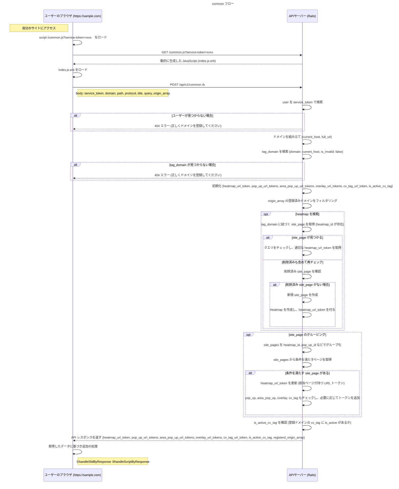

```mermaid

---
title: common フロー
---

sequenceDiagram
    participant UserSite as ユーザーのブラウザ (https://sample.com)
    participant Rails as APIサーバー (Rails)

    Note left of UserSite: 自分のサイトにアクセス
    UserSite->>UserSite: script /common.js?service-token=xxxx　をロード

    UserSite->>Rails: GET /common.js?service-token=xxxx
    Rails-->>UserSite: 動的に生成した JavaScript (index.js.erb)

    UserSite->>UserSite: index.js.erb をロード
    UserSite->>Rails: POST /api/v1/common.rb
    Note right of UserSite: body: service_token, domain, path, protocol, title, query, origin_array

    Rails->>Rails: user を service_token で検索
    alt ユーザーが見つからない場合
        Rails-->>UserSite: 404 エラー (正しくドメインを登録してください)
    end

    Rails->>Rails: ドメインを組み立て (current_host, full_url)
    Rails->>Rails: tag_domain を検索 (domain: current_host, is_invalid: false)
    alt tag_domain が見つからない場合
        Rails-->>UserSite: 404 エラー (正しくドメインを登録してください)
    end

    Rails->>Rails: 初期化 (heatmap_url_token, pop_up_url_tokens, area_pop_up_url_tokens, overlay_url_tokens, cv_tag_url_token, is_active_cv_tag)
    Rails->>Rails: origin_array の登録済みドメインをフィルタリング

    opt heatmap を検索
        Rails->>Rails: tag_domain に紐づく site_page を取得 (heatmap_id が存在)
        alt site_page が見つかる
            Rails->>Rails: クエリをチェックし、適切な heatmap_url_token を取得
        else 削除済みも含めて再チェック
            Rails->>Rails: 削除済み site_page を確認
            alt 削除済み site_page がない場合
                Rails->>Rails: 新規 site_page を作成
                Rails->>Rails: Heatmap を作成し、heatmap_url_token を付与
            end
        end
    end

    opt site_page のグルーピング
        Rails->>Rails: site_pages を heatmap_id, pop_up_id などでグループ化
        Rails->>Rails: site_pages から条件を満たすページを取得

        alt 条件を満たす site_page がある
            Rails->>Rails: heatmap_url_token を更新 (該当ページが持つ URL トークン)
            Rails->>Rails: pop_up, area_pop_up, overlay, cv_tag もチェックし、必要に応じてトークンを追加
        end
    end

    Rails->>Rails: is_active_cv_tag を確認 (登録ドメインの cv_tag に is_active があるか)

    Rails-->>UserSite: API レスポンスを返す (heatmap_url_token, pop_up_url_tokens, area_pop_up_url_tokens, overlay_url_tokens, cv_tag_url_token, is_active_cv_tag, registerd_origin_array)

    UserSite->>UserSite: 取得したデータに基づき追加の処理
    Note right of UserSite: ①handleSlidByResponse ②handleScriptByResponse
```
